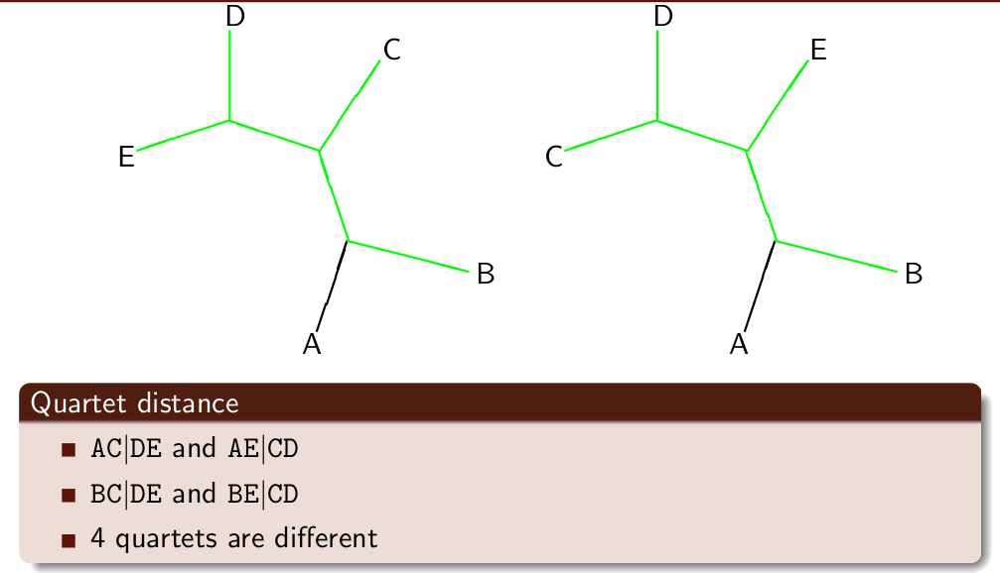
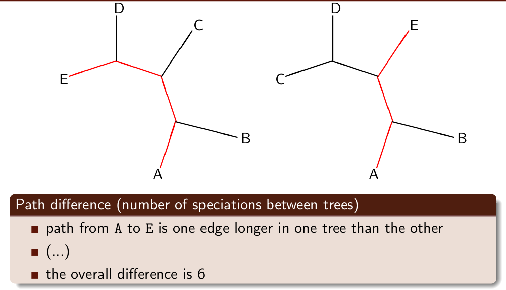
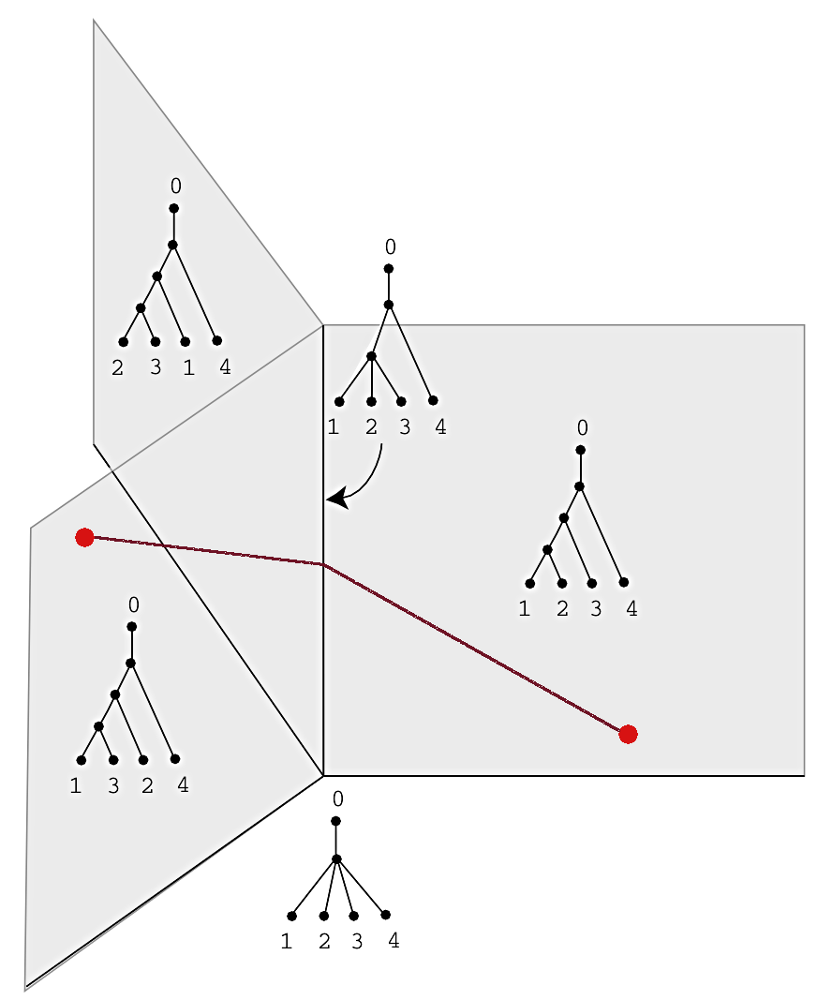

This document is an introduction to phylogenetic trees for use within the Signal Processing Group. 
It is not meant as a general introduction to phylo trees, or as a complete resource for anything else than our personal needs.

This is a draft, with sections and references still missing. If you are from the SPG and want more info (references) please let me know.

## Intro
Phylogenetic trees are weighted, usually undirected trees. The terminology comes from evolutionary theory, as in the Tree of Life. The vertices are called branches, and the weights are the branch lengths. These branches are plotted proportionally to their lengths ---thus specialised visualisation software is needed since a graph representation (e.g. `graphviz`) might misrepresent the branch length information. The tips represent the species or strains or biological entities for which we have a sample (i.e. we observe at the present), and the internal nodes represent an unobserved (ancestral, older than the tips) entity. Sometimes these are called the LCA (least common ancestor) or MRCA (most recent common ancestor) of the tips "below" it. Traditionally (i.e. due to limitations in estimation procedures and some dubious biological explanation) these trees are binary, also called bifurcating. In opposition to trees with polytomies, or multifurcations, which are the nodes with more than 3 neighbouring nodes.

It is usually undirected since although we know there is some time directionality (tips are the present, internal nodes are the past), we cannot infer the root node, that is the node which is the LCA of all tips. Some methods assume we can infer the root, but importantly probabilistic methods (i.e. those based on the _phylogenetic likelihood_) do not.

A topology is a phylogenetic tree without the branch length information, i.e. the unweighted tree. Sometimes this branching pattern is the only information the researcher is interested in (or, in other words, sometimes we have a hard time interpreting the lengths and we can only claim something regarding the splitting of nodes). Notice that I usually interpret the  trees as a construct, that is, something that we infer and that is very useful, but does not represent some deep truth which can be known or solved (many people say that there is no tree of life because life is a network).

## Storage
The standard for storing phylogenetic trees in files is the *newick format*, which is a text hierarchical parenthetic format One example is `((A,B),(C,D))` to mean `A` and `B` together in one ancestor, which is itself connected to the ancestor between `C` and `D`. Notice that this tree looks rooted, because the deeper split is a bifurcation (two daughter nodes). Which is fine as long as the software reading this tree knows that there is no root node (if that is the case, since some models do need the root information). Therefore it is perfectly fine to store phylogenetic trees in data structures expecting a rooted tree. So that, as usual, nodes have one parent and (exactly) two children. Except for the root node, which does not have a parent and only have two children.

Just to mention that there are two ways of "forcing" the newick format to represent unrooted trees: one is to have the deepest node as a trifurcation, as in`((A,B),C,D)` in the example above. Another way, borrowing from the nexus format (see below) is to add the rootedness as a comment, as in `[U] ((A,B),(C,D))`  for unrooted and  `[R] ((A,B),(C,D))`  for rooted. 

Branch lengths are represented as numbers after a colon in a node. The node can be a tip or an internal node, like `((A:1,B:1):0.1,(C:5,D:0.5):0.1):0.333` (notice that the root node can have a branch length, in this case `0.333`). I believe that the "newick" format relates to both the string representation as well as the file format (which assumes one or more such strings per file).
### Nexus format for storing different trees on same data set
Another common file format, popularised by Bayesian tools like `MrBayes` and `BEAST`, is the _nexus format_. It has several less relevant (and outdated) blocks like "DATA" and "DISTANCES", but it has the `TREE` block that can store a collection of trees sharing the same tips (i.e. taxa):
```
Begin TREES;
  Tree tree1 = ((Alpha,Beta),Gamma,Delta);
  Tree tree2 = ((Alpha,Gamma),Beta,Delta);
END;
```
Or, mapping the tip names:
```
Begin TREES;
Translate
1 Alpha, 
2 Beta,
3 Gamma, 
4 Delta;
  Tree tree1 = ((1,2),3,4); [ comments are within brackets, like this]
  Tree tree2 = ((1,3),2,4);
END;
```
For large trees or long tip names, this translation can save some space. Each one of the trees is a newick string. Branch lengths are accepted as usual. Notice that phylogenetic tree formats must be self-contained thus the file must have the tip names. Usually a Bayesian phylogenetics software will output sample trees as above, in nexus format. The some tool can summarise this posterior distribution, giving you something like
```
#NEXUS

Begin trees;
 Translate
        1  schizosaccharomyces_pombe,
        2  saccharomyces_cerevisiae,
        3  drosophila_melanogaster,
        4  caenorhabditis_elegans,
        5  monosiga_brevicollis,
        6  schistosoma_mansoni,
        7  drosophila_yakuba,
        8  gallus_gallus,
        9  homo_sapiens
;
tree tree_1 [p = 0.6000, P = 0.6000] = [&W 0.60000000] ((((7,3),(2,1)),4),(((9,8),5),6));
tree tree_0 [p = 0.4000, P = 1.0000] = [&W 0.40000000] ((((7,3),4),(2,1)),(((9,8),5),6));

End;
```
where the numbers within brackets are the posterior probabilities, and the file is sorted by them. 
### Storage of repeated topology across samples, but with different branch lengths
In the paper (Penn, M. J., Scheidwasser, N., Khurana, M. P., Duchêne, D. A., Donnelly, C. A., & Bhatt, S. (2024). Phylo2Vec: a vector representation for binary trees. _Systematic Biology_. arXiv. https://doi.org/10.1093/sysbio/syae030)  they describe the "Phylo2Vec" integer vector representation of topologies (i.e. without branch lengths). They describe in passing the addition of branch lengths to their representation.

##  Phylogenetic tree inference
Even though of little importance for us at the moment, it is important to mention that there are three main alternatives to phylogenetic tree inference. By the way we usually assume that our samples can be represented by a single tree, while in reality we might need at least a few trees &mdash;that's a story for another time. 

The three inference alternatives are **distance**, **parsimony**, and **likelihood**. Distance methods can be the clustering algorithms we all know and love, or something similar, tailored for evolutionary studies (like "minimum evolution", "neighbour-joining". They are all based on the assumption that a matrix with pairwise distance between samples have all the information for the inference. Parsimony methods try to find the tree that minimises the number of changes, along the tree, for all characters. Likelihood methods are based on a probabilistic description of the changes along the tree (CTMC), which may not correspond to the miminum number of changes as in parsimony. **Bayesian** methods (which some would classify as a fourth alternative) are based on the same likelihood algorithms, but it's not only an optimisation-based inference. 

For all these methods we are usually thinking about the DNA or protein alignments (an assumption of homology at each genetic site), although the same methods can be expanded to presence or not of genes, `k-mers` (`ngrams`) , etc. For likelihood and parsimony, usually we need to keep modifying the tree until we find the best one. This modification is usually based on the current state (tree), since "random" trees will probably have a very low score. Similarly with Bayesian MCMC. See _Reseampling_ below for more information.
## Summarising trees
Given a collection of phylogenetic trees, for instance the posterior distribution from an MCMC algorithm (from RevBayes, BEAST, or PhyloBayes software), we are usually interested in a point estimate of the trees. 
That is, a tree that summarises the information from the whole collection. 
One of the most common such summaries is the **consensus** tree, that is a tree where every branch (split) appears in at least 50% of the trees in the collection, or a multifurcation if no such branch is found. 
This is commonly known as the "majority rule" consensus tree, and there are ways to increase or decrease the 50% value. 
A review can be found in [Bryant, D. (2003). A classification of consensus methods for phylogenetics. _DIMACS Series in Discrete Mathematics and Theoretical Computer Science_, _61_, 163–184.](https://www.ams.org/books/dimacs/061/) (PDF available somewhere over the web). 

Another common approach to summarise a collection of posterior trees is the Maximum Clade Credibility (MCC) tree (see [this BEAST document](https://beast.community/summarizing_trees) for a very quick review of this and more). 
The MCC tree is the one from your collection with the best sum of branch scores, where the score is the number of trees with the same split (branch). In all cases the summary tree only has the topological information, and the branch length must be calculated by other means later, if necessary (for example the mean value over trees with the same branch). 

Each branch (vertex) splits the tree into two subtrees, and the so-called **split** (a.k.a. bipartition) represents this division by listing the tips in each side. For rooted trees they are also known as **clades** since it suffices to describe only the leaves not passing through the root. Most summary methods are based on these splits or clades. 

Notice that the collection of trees can alternatively come from a bootstrap analysis (under a likelihoodist and not Bayesian approach), in which case our tree of choice will be the maximum likelihood tree. But the bootstrap replicates can help assign "bootstrap support" to the nodes or branches.
## Distance between trees
Usually the distance between trees can be calculated when the two leafmaps coincide (i.e. the tip labels are all the same). If there are tip labels missing from one of the trees, then its node is removed from the non-missing tree. 
Below we will see a few used distances
#### Robinson-Foulds (RF)
The RF distance, a.k.a. symmetric distance, is by far the most commonly used 
#### Nearest-Neighbour Interchange (NNI) and Subtree Prune-Regraft (SPR)
#### Quarter distance, Path difference
The quartet distance is the number of quartets that are not shared by the two trees. 
For each split, a quartet is a set of four tips that can be split by the branch (two and two).
[Bryant, D., Tsang, J., Kearney, P., & Li, M. (2000). Computing the quartet distance between evolutionary trees. Proceedings of the Eleventh Annual ACM-SIAM Symposium on Discrete Algorithms, 285–286.](http://dl.acm.org/citation.cfm?id=338264)

The path difference between trees is the sum of differences in all path between tip pairs. A path is the number of edges
traversed between two tips.
If the branch lenghts are used, then the "path" is the patristic distance betweena pair of tips.[Williams, W. T., &
Clifford, H. T. (1971). On the comparison of two classifications of the same set of elements. Taxon, 20(4), 519–522.](https://doi.org/10.2307/1218253)


<br>

#### Geodesic distance
The geodesic distance between trees, in particular the Billera-Holmes-Vogtmann (BHV) distance, is quite desirable since
it works continuously in the BHV treespace, including tree branch lengths.
However it's quite hard to calculate compared to the alternatives.
[Billera, L. J., Holmes, S. P., & Vogtmann, K. (2001). Geometry of the Space of Phylogenetic Trees. Advances in Applied Mathematics, 27(4), 733–767.](https://doi.org/10.1006/aama.2001.0759)

<br>

## Resampling
The NNI and SPR moves, which are used for modifying just a bit the current tree are shown below.
The NNI changes the tree less than the SPR.
There is a generalisation of the SPR called the "tree bisection and reconnection" (TBR) where instead of "prunning" a
subtree, i.e. keeping its root branch, we chose any remaining branches on both subtrees to connect them through a new
branch. 

As usual these moves describe only the topological changes (not branch lengths).

for the moves descriptions, see:
* Barido-Sottani, J., Schwery, O., Warnock, R. C. M., Zhang, C., & Wright, A. M. (2024). Practical guidelines for Bayesian phylogenetic inference using Markov chain Monte Carlo (MCMC). Open Research Europe, 3, 204. https://doi.org/10.12688/openreseurope.16679.3 
* Gasparin, A., Camerota Verdù, F. J., Catanzaro, D., & Castelli, L. (2023). An evolution strategy approach for the Balanced Minimum Evolution Problem. Bioinformatics . https://doi.org/10.1093/bioinformatics/btad660

### Resampling incorporating proximity in non-Euclidean spaces
